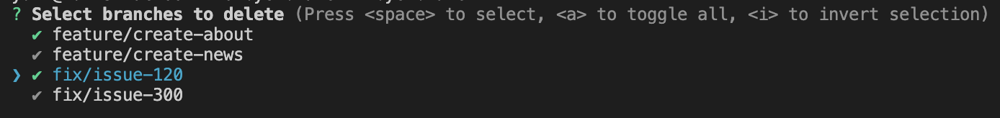

# bye-branch

Remove branches with friendly CLI.
Easy to use, easy to remove.

<!-- /assets/example_1.png -->


# Installation

```bash
$ cargo install bye-branch
```

# Usage

> [!WARNING]  
> You need install [git](https://git-scm.com/) first.

```bash
$ bye-branch
```